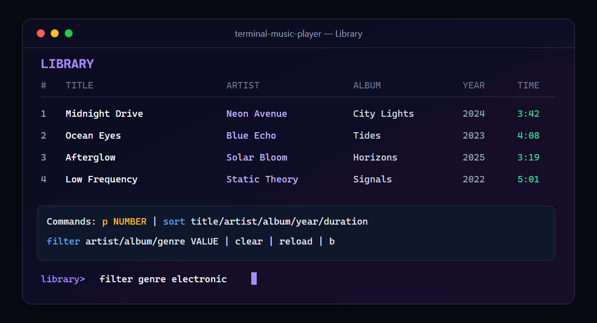
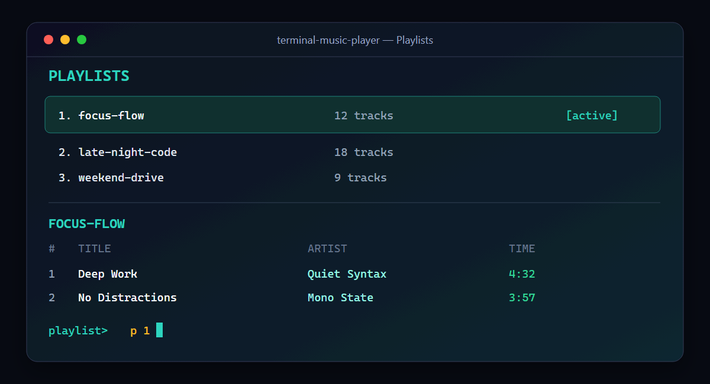
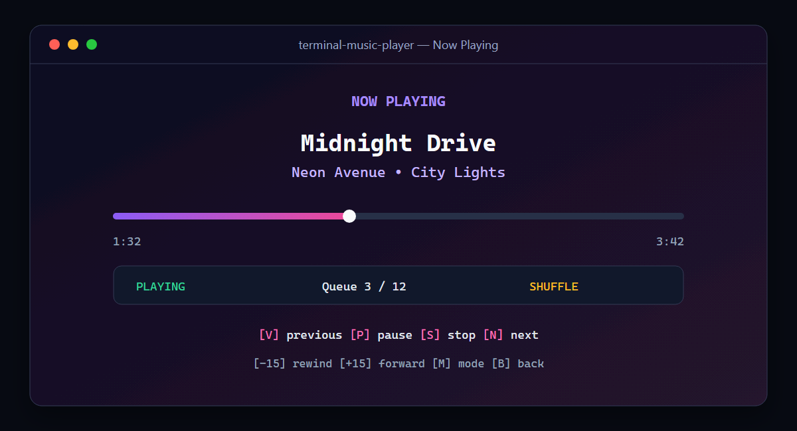
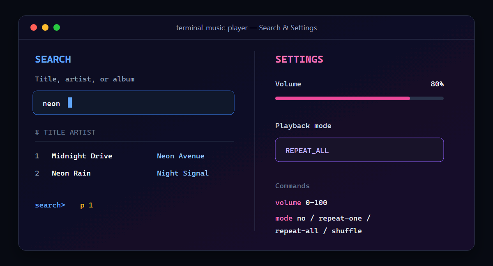

<div align="center">

# Terminal Music Player

**A keyboard-driven C++17 music player for local libraries, playlists, queues, and audio playback.**

[](https://isocpp.org/)
[](https://cmake.org/)
[](https://miniaud.io/)


</div>

## Features

- CSV music-library loading with quoted-field support and actionable warnings
- M3U playlist discovery and path matching against the library
- Case-insensitive search by title, artist, or album
- Exact artist, album, and genre filters
- Sorting by title, artist, album, year, or duration
- Queue playback with play, pause, resume, stop, next, previous, and seek controls
- No-repeat, repeat-one, repeat-all, and shuffle modes
- Persistent volume, playback mode, active playlist, and last-track settings
- Real audio playback through the bundled `miniaudio` library
- Cross-platform CMake configuration and automated core/application tests

## Interface tour

| Library browsing | M3U playlists |
|---|---|
| Search, filter, sort, and start any track directly from the library. | Select a playlist, inspect its ordered tracks, and make it active. |
|  |  |

| Now playing | Search and settings |
|---|---|
| Monitor progress and control the queue, seeking, and playback mode. | Find music across metadata and persist volume and repeat preferences. |
|  |  |

## Requirements

- A C++17 compiler (MSVC, GCC, or Clang)
- CMake 3.16 or newer
- A supported audio device/backend

Linux builds may require the normal ALSA development package provided by the distribution.

## Build and test

```bash
cmake -S . -B build
cmake --build build --config Release
ctest --test-dir build -C Release --output-on-failure
```

Run from the repository root:

```bash
./build/terminal-music-player
```

With multi-configuration generators on Windows, the executable is commonly located at:

```powershell
.\build\Release\terminal-music-player.exe
```

You can use a different data directory from any working directory:

```bash
terminal-music-player --data-dir /path/to/Data
```

## Add your music

Copy or link audio files into `Data/music/`, then create `Data/library.csv`:

```csv
title,artist,album,genre,year,duration_sec,file_path
"Bohemian Rhapsody",Queen,"A Night at the Opera",Rock,1975,354,Data/music/bohemian.mp3
```

The seven columns are required and must remain in that order. CSV quoting follows the common
double-quote convention, so commas and escaped quotes can be used in metadata.

If `Data/library.csv` does not exist, the application loads `Data/library.csv.example` so the
interface can be explored without setup. Audio files themselves are intentionally excluded from Git.

### Playlists

Place `.m3u` files in `Data/Playlists/`. Each non-comment line is an audio path matching a
`file_path` entry in the library:

```m3u
#EXTM3U
Data/music/bohemian.mp3
Data/music/hotel_california.mp3
```

Relative paths are supported. Missing or unmatched entries produce warnings instead of terminating
the application.

### Settings

`Data/settings.cfg` is generated automatically and is ignored by Git. An example looks like:

```ini
active_playlist=rock_hits
playback_mode=SHUFFLE
last_song=Data/music/bohemian.mp3
volume=0.80
```

## Commands

The main menu accepts its item number or English name. Commands are case-insensitive.

| Screen | Commands |
|---|---|
| Library | `p NUMBER`, `sort FIELD`, `filter FIELD VALUE`, `clear`, `reload`, `b` |
| Playlists | playlist number, then `p NUMBER` |
| Search | query, then optionally `p NUMBER` |
| Now Playing | `p`, `s`, `n`, `v`, `+15`, `-15`, `m`, `b` |
| Settings | `volume 0-100`, `mode no/repeat-one/repeat-all/shuffle`, `b` |

`B`, `Back`, or an empty line returns from a child screen. `Q`, `Quit`, or `Exit` closes the
application from the main menu. End-of-input also exits cleanly.

## Project structure

```text
terminal-music-player-cpp/
├── CMakeLists.txt
├── Data/
│   ├── library.csv.example
│   ├── Playlists/
│   └── music/
├── docs/
├── src/
│   ├── Application.*       terminal workflows
│   ├── ConfigManager.*     settings persistence
│   ├── DataLoader.*        CSV and M3U parsing
│   ├── MusicLibrary.*      queries, filters, and sorting
│   ├── Player.*            miniaudio playback and queue state
│   ├── Playlist.*          ordered playlist model
│   └── Song.*              track metadata model
└── tests/
    ├── ApplicationTests.cpp
    └── CoreTests.cpp
```

See [Core architecture](docs/CORE_ARCHITECTURE.md) for component boundaries and ownership.

## Status

- [x] Song, library, and playlist domain models
- [x] CSV metadata and M3U playlist loading
- [x] Search, filter, and sorting operations
- [x] Playback queue and all playback modes
- [x] `miniaudio` integration
- [x] Complete terminal screens and validated commands
- [x] Persistent application settings
- [x] Core and application-level automated tests

---

**Author:** Fatima
