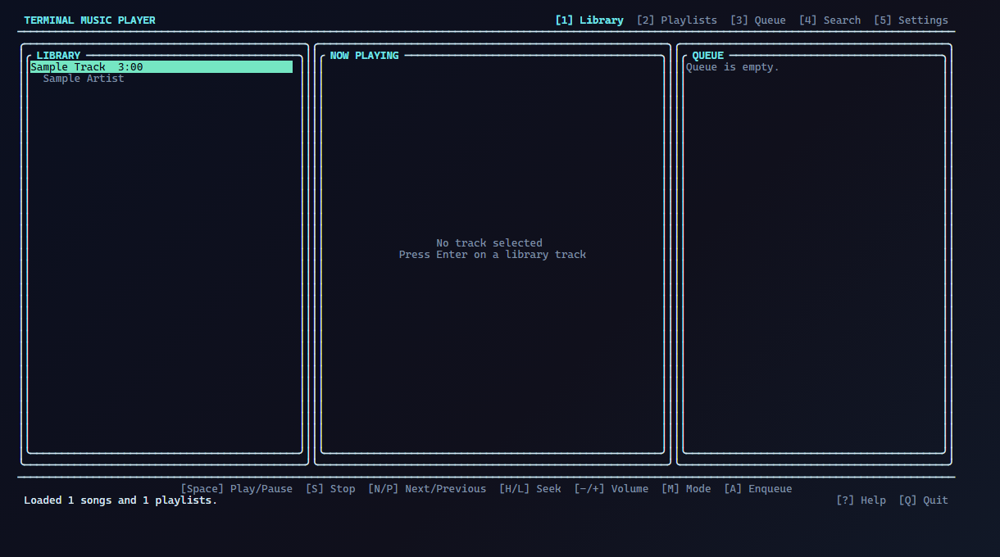

<div align="center">

# Terminal Music Player

A keyboard-driven C++17 terminal player for local music libraries, editable playlists, queues,
and real audio playback.

[](https://github.com/void-fatima/terminal-music-player-cpp/actions/workflows/ci.yml)
[](https://isocpp.org/)
[](LICENSE)



_Actual application frame generated from the built FTXUI renderer with the repository's sample data.
No artwork, waveform, spectrum, playback progress, or playback state is fabricated._

Maintainers can reproduce it after a Debug build with `node tools/capture-ui-screenshot.mjs`.
The helper accepts `MUSIC_PLAYER_EXE`, `MUSIC_PLAYER_DATA_DIR`, `MUSIC_PLAYER_SCREENSHOT`, and
`MUSIC_PLAYER_BROWSER` overrides.

</div>

## What works

- Immediate keyboard input in a resize-aware FTXUI interface—no Enter key required for playback
  controls or navigation
- Library, Now Playing, Queue, Playlists, Search, Settings, and shortcut/help views
- Continuous 200 ms player updates, so completed tracks advance while the user is idle
- No repeat, repeat one, repeat all, and shuffle with real previous-track history
- Play, pause, resume, stop, next, previous, seek, volume, and direct queue-item playback
- Queue add, remove, clear, reorder, and play-from-any-item operations
- Local playlist create, rename, confirmed delete, add/remove/reorder, reload, and safe M3U/M3U8 save
- Stable 64-bit song IDs derived from normalized media paths with collision detection
- Indexed ID/path lookup, deterministic sorting, and linear-time playlist resolution
- Strict CSV headers, UTF-8 BOM support, quoted commas/quotes, validation, and line-numbered warnings
- Failure-safe settings and playlist replacement through unique same-directory temporary files
- A deterministic stream interface and fake audio backend for device-free automated testing
- UTF-8-safe terminal truncation for Persian, accented text, emoji, and CJK metadata

## Platform status

The CI matrix builds with Ubuntu GCC, Ubuntu Clang, macOS Clang, and Windows MSVC in Debug and/or
Release configurations. The Linux GCC Debug job also runs AddressSanitizer and
UndefinedBehaviorSanitizer. At the time of this hardening pass, Windows GCC 16.1 was verified
locally; the other toolchains remain pending their first GitHub Actions run and are therefore not
claimed as locally verified.

Requirements:

- A C++17 compiler
- CMake 3.16 or newer
- Git and network access during the first configure (CMake fetches pinned FTXUI `v7.0.1`)
- A miniaudio-supported output device for real playback

## Build and test

Single-configuration generators such as Ninja or Unix Makefiles:

```bash
cmake -S . -B build -G Ninja -DCMAKE_BUILD_TYPE=Release \
  -DMUSIC_PLAYER_WARNINGS_AS_ERRORS=ON
cmake --build build --parallel
ctest --test-dir build --parallel 4 --output-on-failure
```

Visual Studio/MSVC:

```powershell
cmake -S . -B build -A x64 -DMUSIC_PLAYER_WARNINGS_AS_ERRORS=ON
cmake --build build --config Release --parallel
ctest --test-dir build -C Release --parallel 4 --output-on-failure
```

The automated tests never initialize miniaudio or require an audio device. To build the optional
manual real-device test:

```bash
cmake -S . -B build -DMUSIC_PLAYER_BUILD_AUDIO_SMOKE_TEST=ON
cmake --build build --target terminal-music-player-audio-smoke
./build/terminal-music-player-audio-smoke /path/to/a/known-good-audio-file.mp3
```

The smoke test plays five seconds. A successful exit proves API/device setup and cleanup, but a
person must confirm the audio was audible.

## Run

From the repository root:

```bash
./build/terminal-music-player
```

On a Visual Studio multi-configuration build, use `build/Release/terminal-music-player.exe`.

Options:

```text
--data-dir PATH       Use a different Data directory
--non-interactive     Force the deterministic line/stream interface
--no-color            Honor a no-color terminal experience
--snapshot            Render one deterministic UI frame and exit
-h, --help            Show usage
```

Interactive mode is selected only when both standard input and output are terminals. Redirected
input, CI, and scripts automatically use the stream interface and exit cleanly on EOF.

## Keyboard shortcuts

| Key | Action |
|---|---|
| `1` … `5` | Library, Playlists, Queue, Search, Settings |
| Arrow keys or `J`/`K` | Move selection; left/right also adjust settings or focus |
| `Tab` | Cycle panel focus |
| `Enter` | Play/activate the focused item |
| `Space` | Play/pause/resume |
| `S`, `N`, `P` | Stop, next, previous |
| `H`, `L` | Seek backward/forward 15 seconds |
| `-`, `+` | Adjust volume in 5% steps |
| `M` | Cycle playback mode |
| `/` | Open search |
| `A` | Add the selected library track to the queue or selected playlist |
| `E` | Enqueue the selected playlist |
| `C` | Create a playlist, or clear the focused queue |
| `R` | Rename the selected playlist |
| `X` | Remove an item; playlist deletion requires `Y` confirmation |
| `U`, `D` | Move a queue or playlist track up/down |
| `O` | Reload library and playlists from disk |
| `?` / `F1` | Toggle shortcut help |
| `Q` | Save settings, stop audio, and quit |

Stop preserves the queue and selected track, rewinds playback to zero, and leaves the player ready
to start that selection again. Repeat One affects automatic completion; manual Next still means
“move forward.” Repeat All wraps, and Shuffle selects a different track when possible.

## Library data

The application reads `Data/library.csv`, falling back to `Data/library.csv.example`. The exact
seven-column header and order are required:

```csv
title,artist,album,genre,year,duration_sec,file_path
"Bohemian Rhapsody",Queen,"A Night at the Opera",Rock,1975,354,music/bohemian.mp3
```

- A UTF-8 BOM is accepted.
- Quoted commas and doubled quotes (`""`) are accepted.
- Title and file path are required; duration must be 1–86400 seconds.
- Year may be `0` (unknown) or 1000 through next calendar year.
- Relative paths resolve from the data directory. Existing `Data/music/...` entries remain
  compatible.
- Missing audio files are loaded as metadata but produce visible warnings.
- Song identity is FNV-1a 64 over a lexically normalized, `/`-separated, ASCII-case-folded path
  relative to the data directory. This is deterministic across CSV row order and platforms;
  collisions are rejected rather than silently merged.

## Playlists and queue

`.m3u`, case variants such as `.M3U`, and UTF-8 `.m3u8` files are discovered in
`Data/Playlists`. Blank lines and comments are ignored, track paths resolve relative to the
playlist file, and ordering is preserved. Empty playlists are retained with a warning.

Edits are saved as external-compatible M3U/M3U8 text. Playlist names are checked against invalid
cross-platform filename characters and duplicate names. Saves use the same atomic replacement
service as settings; a failed replacement does not delete the prior file.

The queue is session state rather than a persisted playlist. It can contain library tracks or all
tracks from a playlist, supports duplicates intentionally, and remains present after Stop.

## Settings safety

`Data/settings.cfg` stores volume, playback mode, active playlist, and the last selected song.
Malformed values retain safe defaults. Saves create a process- and counter-unique temporary file in
the same directory, flush it to storage, close it, then replace the destination without a
remove-first window. Concurrent writers are last-successful-writer-wins; this is not a transactional
merge and no long-lived inter-process lock is held. Matching abandoned temporaries older than 24
hours are cleaned before a write; recent concurrent temporaries are left untouched.

## Audio troubleshooting

- First check that the CSV path exists and is readable. Loader warnings include the offending line.
- Linux playback uses whichever miniaudio backend is available at runtime. Install/enable the normal
  ALSA/PulseAudio/PipeWire compatibility packages for the distribution if engine initialization
  fails.
- On Windows, confirm the selected output device is enabled and not held exclusively by another app.
- On macOS, confirm Terminal has permission to use audio output and that an output device exists.
- Use the optional audio smoke executable with a known-good file to distinguish device/backend
  problems from library parsing problems.

## Architecture

Reusable `music-player-core`, `music-player-audio`, and `music-player-application` targets separate
domain/loading/persistence, playback policy/device integration, and user interfaces. `Player`
depends only on `IAudioBackend`; tests inject `FakeAudioBackend`, while production constructs
`MiniaudioBackend`. FTXUI input and the 200 ms ticker are converted to events, so the
`SessionController` and `Player` remain owned and mutated by one UI thread.

See [Core architecture](docs/CORE_ARCHITECTURE.md) for ownership, lifecycle, persistence guarantees,
and target boundaries. Historical design art is explicitly archived as
[Concept Mockups](docs/images/concepts/README.md).

## Known limitations

- Local playback only: no streaming services, network catalog, accounts, tags editor, or cover-art
  extraction.
- Unicode cell width uses FTXUI for the interactive renderer and a deterministic project helper for
  stream tables. Complex grapheme clusters and unusual terminal font policies can still differ by
  one cell.
- Playlist files do not preserve third-party comments when edited; they are rewritten as a clean
  `#EXTM3U` plus ordered paths.
- Settings/playlist saves guarantee failure-safe replacement and collision-free temporaries, not
  multi-process transaction merging.
- The real miniaudio smoke test is deliberately manual and was not run without a user-provided valid
  audio fixture and an available output device.

## License

First-party code is licensed under the [MIT License](LICENSE). Bundled miniaudio 0.11.25 is
unmodified and retains its public-domain/MIT-0 choice in
[`third_party/miniaudio/miniaudio.h`](third_party/miniaudio/miniaudio.h). FTXUI is fetched at its
pinned upstream tag and remains under its own upstream license.
